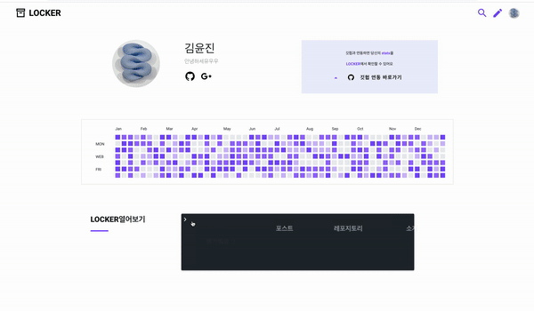

<h1 align="center"> Locker 📦 </h1>

Spring Boot & Vue를 이용한 Restful 웹 프로젝트

<a href="http://i3a606.p.ssafy.io/">Locker</a> is a high quality elegant developer blog. It is crafted from scratch, with love.

</a>       

 

 

<h2 align="center"> 목차 📜 </h2>

### ✔︎ 소개
  - [X] 멤버
  - [X] 프로젝트
### ✔︎ 서비스
  - [X] 레포지토리 소개
  - [X] 로그인
  - [X] 마이페이지
  - [X] 메인페이지
  - [X] 포스팅
  - [X] 검색기능
### ✔︎ 회고
  - [X] SSAFY 2학기 공통프로젝트 회고
    - [X] 우리는 이렇게 협업한다
    - [X] 코드에 대한 고찰 | TMI 주의 ⚠️
  - [ ] 마주했던 이슈들
    - [ ] JPA 도입 계기
    - [ ] 우리가 도커를 사용한 이유
    - [ ] 로그인 기능을 구현하며 마주한 이슈
      - [X] 소셜 로그인은 왜 할까 ❓ (feat. OAuth2)

 

 

<h2 align="center"> 소개 🏷 </h2>

### LOCKER

> [LOCKER 바로가기](http://i3a606.p.ssafy.io/)
>
> [스크럼 기록 바로가기](https://www.notion.so/LOCKER-23e10fa8c4cb42d29c3f6719823be559)

- 팀명 & 서비스 이름 : LOCKER

- 팀장 : 배현석

- 팀원 : 김윤진, 김준호, 윤재원

- 프로젝트 기간 : 2020.7.20 ~ 2020.08.30 (6주)

 

### 멤버 👋

| 이름                                                  | 역할             | 내용                                                         |
| ----------------------------------------------------- | ---------------- | ------------------------------------------------------------ |
| [김윤진](https://github.com/YNNJN) [Front Carry]      | FE, 기획, 디자인 | 포스트/댓글 CRUD(FE), github 데이터 연동(FE), 마크다운파서 구현 |
| [김준호](https://github.com/junhok82) [프로 일꾼]     | BE, 인프라, 기획 | 회원관리(BE), 소셜로그인(BE), github 데이터 연동(BE), 인프라 구축 |
| [배현석](https://github.com/beaverbae2) [풀스택 팀장] | BE, FE           | 포스트/댓글 CRUD(BE), 검색/태그/좋아요/사진등록(BE&FE)       |
| [윤재원](https://github.com/jane399) [개발천재]       | FE, 영상         | 회원관리(FE), 소셜로그인(FE), 레포지토리 추가/삭제(FE), 영상 제작 |

> Special thanks to 수재 컨설턴트님 and 윤재 코치님 for valuable tips as always..!

 

### 프로젝트

>  Github과 가장 긴밀하게 연결되는 새로운 솔루션, **LOCKER**
>
>  - '개발자가 만든 개발자 블로그'를 모토로
>  - 개발자로서 가장 불편한 지점에 대한 문제의식에서 시작했습니다
>  - 개발자, 일단 넌 LOCKER에 다 때려 넣어봐. 정리는 우리가 할게 :)

 

1. 블로그의 기본 기능은 물론
2. 깃헙의 **`레포지토리 별로 포스트를 관리하는`** 기능
3. 포스팅 욕구를 자극하는 세련된 UI까지!

 

  

 

 

<h2 align="center"> 서비스 ⭐️ </h2>

## 핵심 기능

### 레포지토리 탭

#### 깃헙 레포와 연동

> 깃헙의 레포지토리와 연동이 가능합니다.  
> Drag & Drop 방식을 통해 레포지토리와의 연동 여부를 결정할 수 있습니다.

  

#### 레포의 포스트 작성

> 포스트 작성 시 연결할 레포지토리를 선택할 수 있습니다.  
> 이를 통해 레포지토리 별로 포스트를 관리할 수 있습니다.

  

#### 레포의 상세 정보 확인 [README / 스탯 / 사용 언어비율]

> 레포지토리의 README, 스탯, 사용 언어비율 정보를 제공합니다.  
> 또한 레포지토리와 연계된 포스트의 태그 정보를 제공합니다. 

  

#### 레포의 상세 정보 확인 [커밋 & 포스트 타임라인 / 포스트 내역]

> 레포지토리 별로 커밋과 포스팅 내역을 타임라인 형태로 제공합니다.  
> 커밋 내역은 실제 커밋 링크로, 포스팅 내역은 실제 포스트 화면으로 연결됩니다.

  

#### 깃헙과의 연동 유도

> LOCKER를 가장 효과적으로 이용할 수 있는 방법인 깃헙과의 연동을 제안합니다.  
> 깃헙 연동을 통해 레포지토리 별 포스트 관리/유저 스탯 확인/깃헙 소개글 연동이 가능합니다.

  

 

 

## 기본 기능

### 로그인 

> 깃헙, 카카오, 구글, 네이버의 소셜로그인을 통해 쉽게 로그인할 수 있습니다.  
> 이메일 인증 단계를 거쳐 가입이 확정됩니다.  
> 비밀번호를 잊어버렸다면 비밀번호 찾기 기능을 이용할 수 있습니다.

  

 

### 마이페이지

 

### 메인페이지

> 레포지토리와 전체 포스트를 좋아요 수를 기준으로 정렬하여 보여줍니다.  
> Infinity Scroll을 적용하였고, Scroll to Top 기능을 이용할 수 있습니다.

  

 

### 포스팅

#### 포스트 작성/수정

> 포스트와 관련된 태그를 등록할 수 있습니다.  
> 포스트 작성 시 마크다운 문법의 적용을 미리보기로 확인할 수 있습니다.

  

#### 포스트 읽기/삭제

> 포스트의 내용을 확인할 수 있습니다. 커스텀한 마크다운 UI가 적용되어 보여집니다.  
> 또한 왼쪽의 라벨을 통해 포스트의 목차와 진행 정도를 확인할 수 있습니다.

  

> 마음에 드는 포스트에 좋아요를 누를 수 있습니다.  
> 또한 댓글과 대댓글을 작성할 수 있습니다.

  

 

### 검색기능
#### 일반 검색

> 검색 결과에 해당하는 포스트 내역을 확인할 수 있습니다.  
> 검색의 범위는 포스트의 제목과 내용이 해당됩니다.

  

#### 태그 검색

> 검색어 앞에 #을 붙여 태그를 검색하고, 검색 결과에 해당하는 포스트 내역을 확인할 수 있습니다.  
> 포스트에 등록된 태그를 클릭하는 방식의 검색 또한 가능합니다.

  

 

 

<h2 align="center"> 성과 ❗️ </h2>

- 🥉 SSAFY(삼성청년SW아카데미) 공통PJT 3등상 수상
- SSAFY 공통PJT 3주차 베스트 팀 선정(LOCKER)
- SSAFY 공통PJT 4주차 베스트 멤버 선정(배현석)
- SSAFY 공통PJT 6주차 베스트 멤버 선정(김윤진)

 

 

<h2 align="center"> 회고 ❗️ </h2>

### 공통프로젝트 회고 
- [X] [우리는 이렇게 협업한다](https://velog.io/@junhok82/Wecollaboratelikethis)
- [X] [코드에 대한 고찰 | TMI 주의 ⚠️](https://velog.io/@junhok82/SSAFY-%EA%B3%B5%ED%86%B5%ED%94%84%EB%A1%9C%EC%A0%9D%ED%8A%B8-%ED%9A%8C%EA%B3%A0-%EC%BD%94%EB%93%9C%EC%97%90-%EB%8C%80%ED%95%9C-%EA%B3%A0%EC%B0%B0-TMI-%EC%A3%BC%EC%9D%98)

 

### 우리가 마주했던 이슈들
- [ ] JPA 도입 계기
- [ ] 우리가 도커를 사용한 이유
- [ ] 로그인 기능을 구현하며 마주한 이슈
  - [X] [소셜 로그인은 왜 할까 ❓ (feat. OAuth2)](https://velog.io/@junhok82/OAuth2)
