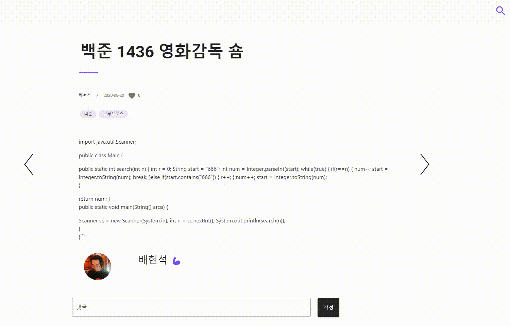

<h1 align="center"> Locker 📦 </h1>

Spring Boot & Vue를 이용한 Restful 웹 프로젝트

<a href="http://i3a606.p.ssafy.io/">Locker</a> is a high quality elegant developer blog. It is crafted from scratch, with love.

</a>       

 

<h2 align="center"> 목차 📜 </h2>

### ✔︎ 소개
  - [X] Contributors
  - [X] 프로젝트
### ✔︎ 서비스
  - [X] 로그인
  - [X] 마이페이지
  - [X] 메인페이지
  - [X] 포스팅
  - [X] 검색기능  
  - [X] 레파지토리 소개
### ✔︎ 마주했던 이슈들
  - [ ] 우리는 이렇게 협업한다
  - [ ] JPA 도입 계기
  - [ ] 우리가 도커를 사용한 이유
  - [ ] 로그인 기능을 구현하며 마주한 이슈
### ✔︎ 회고
  - [ ] SSAFY 2학기 공통프로젝트 회고

 

<h2 align="center"> 소개 🏷 </h2>

### 팀원 👋
 

### 프로젝트 📌

<h2 align="center"> 서비스 🔑 </h2>

### 로그인 📌

 

### 마이페이지 📌

 

### 메인페이지 📌

 

#### 핫 레포지토리

> LOCKER에 등록된 레포지토리 중 좋아요 수가 가장 많은 TOP3 레포지토리를 보여줍니다

  

#### 인기 포스트 보기

> 좋아요가 많은 순으로 포스트를 보여줍니다

  

#### 공지사항

> 공지사항을 볼 수 있습니다

  

 

### 포스팅 📌

#### 글 작성

> 포스팅하는 글과 관련된 태그를 달 수 있습니다.
> 커스텀된 마크다운을 이용하여 글을 작성할 수 있습니다.

  

#### 글 작성 이후

> 해당 글의 썸네일을 설정할 수 있습니다.
> 내 깃허브 레파지토리와 연동할 수 있습니다. 

  

#### 글 읽기

> 커스텀한 마크다운을 이용하여 글 내용을 확인 가능합니다.
> 글을 읽어내려가면, 왼쪽 타임라인 부분에 어느 부분을 읽고 있는지 표시됩니다.

  

> 맘에 드는 글에 좋아요를 누를 수 있습니다.
> 댓글을 달 수 있고, 다른 사람 댓글에 대댓글을 달 수 있습니다.

  

 

### 검색기능 📌
#### 일반 검색

> 제목이나 내용에서 검색어가 포함된 포스팅들을 보여줍니다

  

#### 태그 검색

> 검색어 앞에 #을 붙이면 태그 검색이 됩니다
> 검색한 태그를 포함하는 포스트들을 보여줍니다

  

#### 태그 클릭 검색

> 포스트에 등록된 태그를 클릭하면 태그 검색이 됩니다

  

 

### 레파지토리 소개 📌

 

<h2 align="center"> 마주했던 이슈들 ❗️ </h2>

- [우리는 이렇게 협업한다]()
- [JPA 도입 계기]()
- [우리가 도커를 사용한 이유]()
- [로그인 기능을 구현하며 마주한 이슈]()

 

<h2 align="center"> 회고 ❓ </h2>

- [SSAFY 2학기 공통프로젝트 회고]()