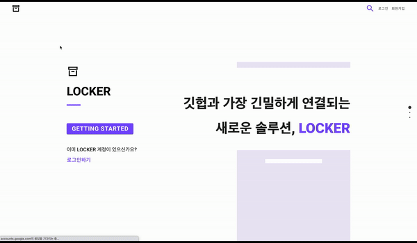
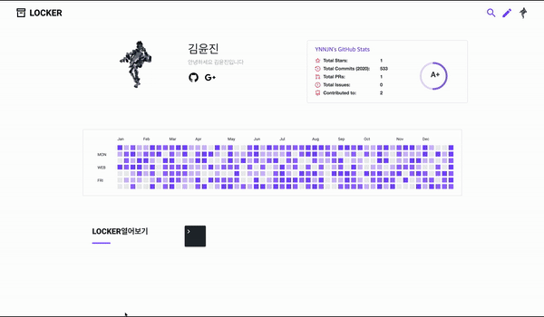
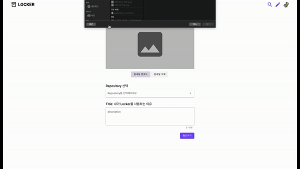
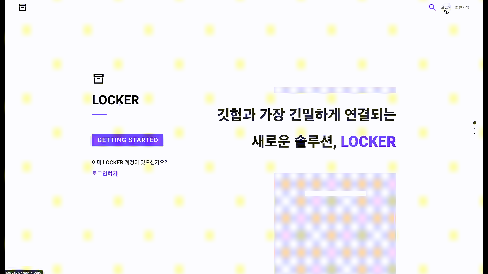
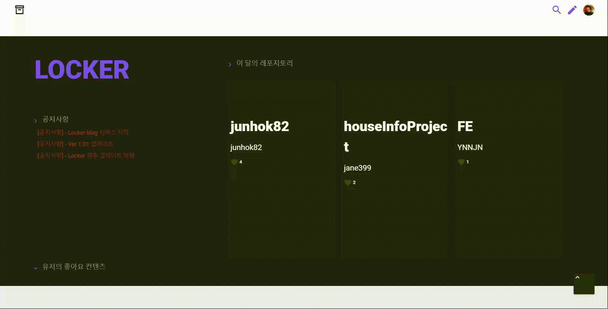
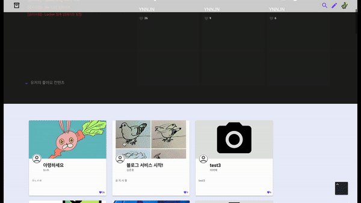
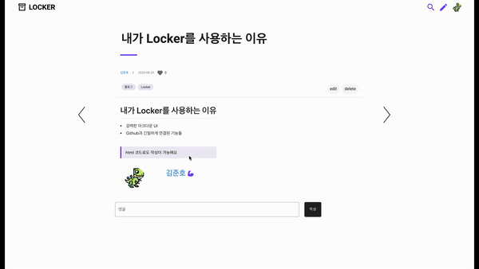
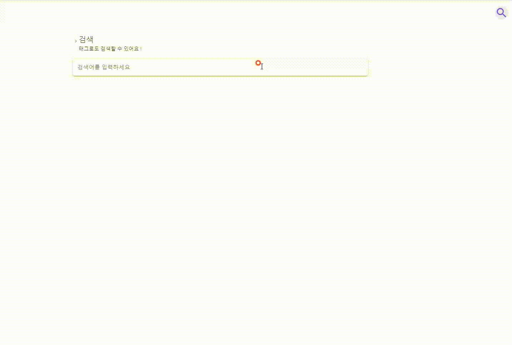
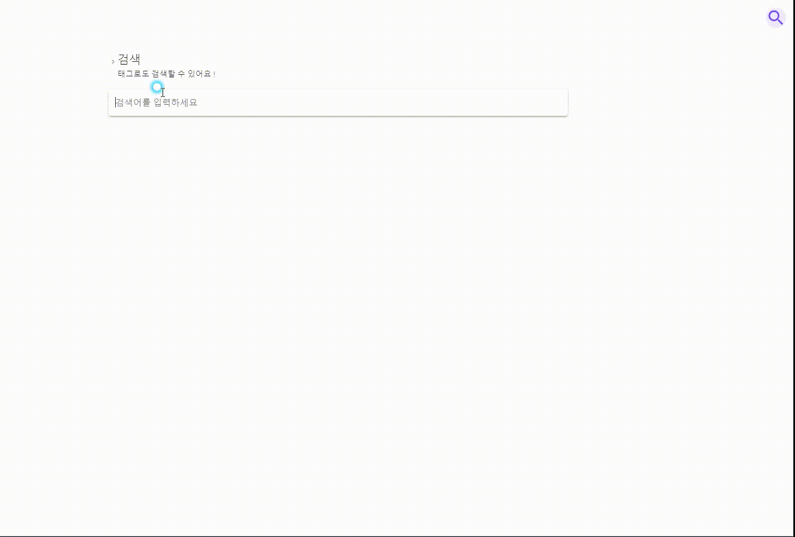

<h1 align="center"> Locker 📦 </h1>

Spring Boot & Vue를 이용한 Restful 웹 프로젝트

<a href="http://i3a606.p.ssafy.io/">Locker</a> is a high quality elegant developer blog. It is crafted from scratch, with love.

</a>       

 

 

<h2 align="center"> 목차 📜 </h2>

### ✔︎ 소개
  - [X] 멤버
  - [X] 프로젝트
### ✔︎ 서비스
  - [X] 로그인
  - [X] 마이페이지
  - [X] 메인페이지
  - [X] 포스팅
  - [X] 검색기능  
  - [X] 레포지토리 소개
### ✔︎ 회고
  - [X] SSAFY 2학기 공통프로젝트 회고
    - [X] 우리는 이렇게 협업한다
    - [X] 코드에 대한 고찰 | TMI 주의 ⚠️
  - [ ] 마주했던 이슈들
    - [ ] JPA 도입 계기
    - [ ] 우리가 도커를 사용한 이유
    - [ ] 로그인 기능을 구현하며 마주한 이슈
      - [X] 소셜 로그인은 왜 할까 ❓ (feat. OAuth2)

 

 

<h2 align="center"> 소개 🏷 </h2>

### 멤버 👋

#### Frontend

- [김윤진](https://github.com/YNNJN) Front Carry
- [배현석](https://github.com/beaverbae2) 팀장
- [윤재원](https://github.com/jane399) 개발천재

#### Backend

- [김준호](https://github.com/junhok82) slave
- [배현석](https://github.com/beaverbae2) 팀장

#### 인프라
- [김준호](https://github.com/junhok82) slave

#### 기획

- [김윤진](https://github.com/YNNJN) Front Carry
- [김준호](https://github.com/junhok82) slave

#### 디자인

- [김윤진](https://github.com/YNNJN) Front Carry

 

### 프로젝트

- Github과 가장 긴밀하게 연결되는 개발자 블로그
- 블로그의 기본 기능은 물론
- 깃허브의 **`레포지토리 별로 포스트를 관리하는`** 기능
- 포스팅 욕구를 자극하는 세련된 UI까지!
- 이제 당신의 LOCKER를 여세요 :)

  

 

 

<h2 align="center"> 서비스 ⭐️ </h2>

## 핵심 기능

#### 깃헙 레포와 연동

> 깃헙의 레포지토리와 연동이 가능합니다.
> Drag & Drop 방식을 통해 레포지토리와의 연동 여부를 결정할 수 있습니다.

  

#### 레포의 포스트 작성

> 포스트 작성 시 연결할 레포를 선택할 수 있습니다.
> 이를 통해 레포 별로 포스트를 관리할 수 있습니다.

  

#### 레포의 상세 정보 확인 [README / 스탯 / 사용 언어비율]

> 레포지토리의 README, 스탯, 사용 언어비율 정보를 제공합니다.
> 또한 레포지토리와 연계된 포스트의 태그 정보를 제공합니다. 

  

#### 레포의 상세 정보 확인 [커밋 & 포스트 타임라인 / 포스트 내역]

> 레포지토리 별로 커밋과 포스팅 내역을 타임라인 형태로 제공합니다.
> 커밋 내역은 실제 커밋 링크로, 포스팅 내역은 실제 포스트 링크로 연결됩니다.

  

 

 

## 기본 기능

### 로그인 

> 소셜로그인을 통해 쉽게 로그인할 수 있습니다.

  

 

### 마이페이지

 

### 메인페이지

#### 핫 레포지토리

> LOCKER에 등록된 레포지토리 중 좋아요 수가 가장 많은 TOP3 레포지토리를 보여줍니다.

  

#### 인기 포스트 보기

> 좋아요가 많은 순으로 포스트를 보여줍니다.

  

#### 공지사항

> 공지사항을 볼 수 있습니다.

  

 

### 포스팅

#### 포스트 작성

> 포스트와 관련된 태그를 등록할 수 있습니다.
> 커스텀된 마크다운을 이용하여 글을 작성할 수 있습니다.

  

#### 포스트 작성 이후

> 해당 포스트의 썸네일을 설정할 수 있습니다.
> 내 깃허브의 레포지토리와 연동할 수 있습니다. 

  

#### 포스트 읽기

> 포스트의 내용을 확인할 수 있습니다. 커스텀한 마크다운 UI가 적용되어 보여집니다.
> 또한 왼쪽의 라벨을 통해 포스트의 목차와 진행 정도를 확인할 수 있습니다.

  

> 마음에 드는 포스트에 좋아요를 누를 수 있습니다.
> 또한 댓글과 대댓글을 작성할 수 있습니다.

  

 

### 검색기능
#### 일반 검색

> 검색 결과에 해당하는 포스트 내역을 확인할 수 있습니다.
> 검색의 범위는 포스트의 제목과 내용이 해당됩니다.

  

#### 태그 검색

> 검색어 앞에 #을 붙여 태그를 검색하고, 검색 결과에 해당하는 포스트 내역을 확인할 수 있습니다.
> 포스트에 등록된 태그를 클릭하는 방식의 검색 또한 가능합니다.

  

 

 

<h2 align="center"> 회고 ❗️ </h2>

### 공통프로젝트 회고 
- [X] [우리는 이렇게 협업한다](https://velog.io/@junhok82/Wecollaboratelikethis)
- [X] [코드에 대한 고찰 | TMI 주의 ⚠️](https://velog.io/@junhok82/SSAFY-%EA%B3%B5%ED%86%B5%ED%94%84%EB%A1%9C%EC%A0%9D%ED%8A%B8-%ED%9A%8C%EA%B3%A0-%EC%BD%94%EB%93%9C%EC%97%90-%EB%8C%80%ED%95%9C-%EA%B3%A0%EC%B0%B0-TMI-%EC%A3%BC%EC%9D%98)

 

### 우리가 마주했던 이슈들
- [ ] JPA 도입 계기
- [ ] 우리가 도커를 사용한 이유
- [ ] 로그인 기능을 구현하며 마주한 이슈
  - [X] [소셜 로그인은 왜 할까 ❓ (feat. OAuth2)](https://velog.io/@junhok82/OAuth2)
